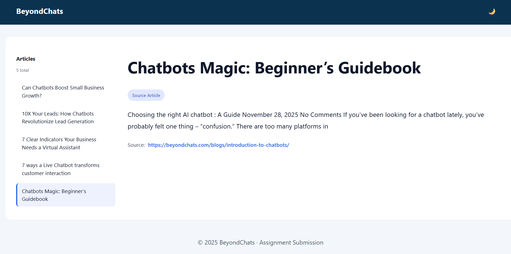
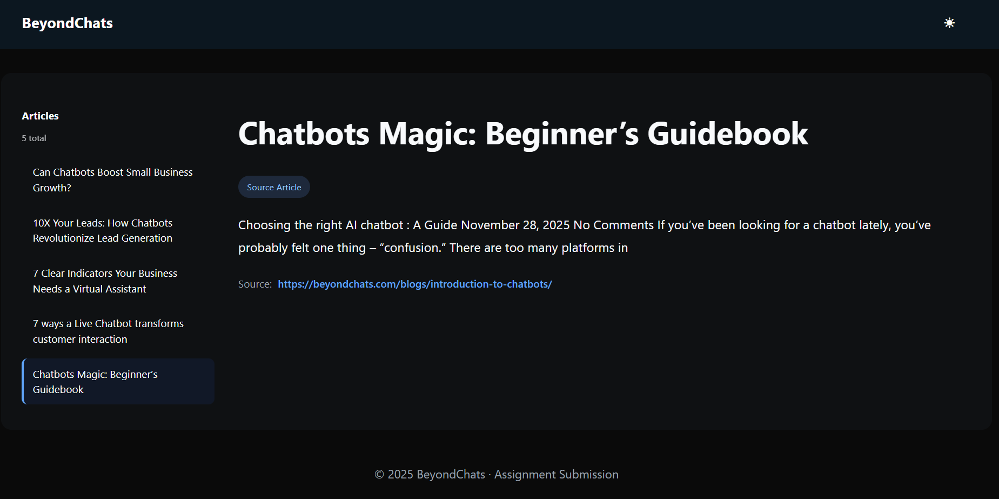
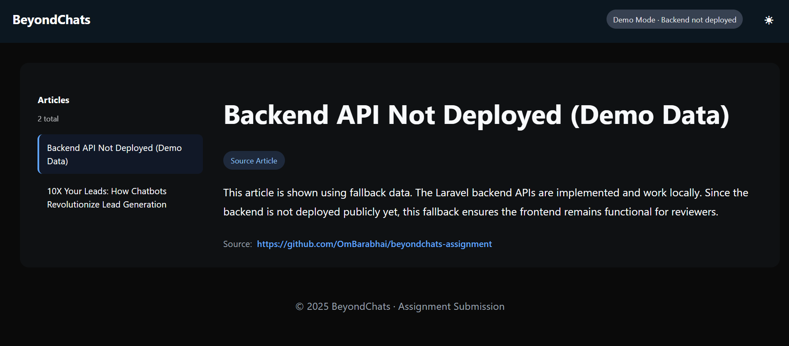
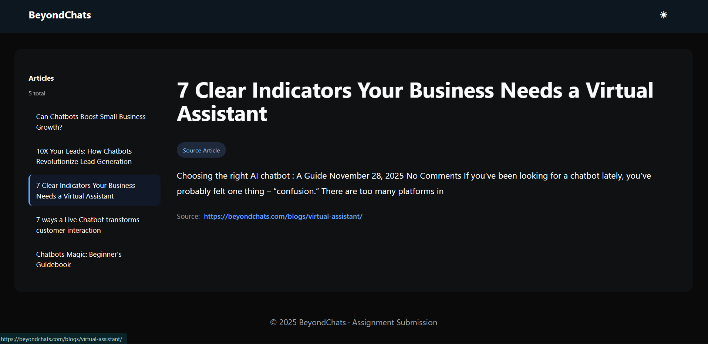

# BeyondChats – Full Stack Engineer / Technical Product Manager Assignment

This repository contains my submission for the **BeyondChats Full Stack Engineer / Technical Product Manager** assignment.

The goal of this assignment was to demonstrate **real-world engineering judgment** - including system design, trade-offs, deployment awareness, and clean execution - rather than only maximizing feature count.

---

## 🔧 Tech Stack

### Backend

- **Laravel (PHP 8.2)**
- SQLite (local development)
- Symfony HTTP Client + DomCrawler
- RESTful APIs

### Frontend

- **React (Vite)**
- Custom CSS (no UI frameworks)
- Dark / Light mode
- Responsive, zoom-safe UI

### Planned / Design-Level

- Node.js
- LLM APIs (OpenAI / Claude)

---

## 🧱 High-Level Architecture

```
BeyondChats Blog
        ↓
Laravel Scraper Command
        ↓
Articles Database
        ↓
REST APIs
        ↓
React Dashboard
```

This mirrors a realistic **internal content pipeline** used in production systems.

---

## 📁 Repository Structure

```
beyondchats-assignment/
├── backend-laravel/        # Scraping + CRUD APIs
├── frontend-react/         # React dashboard (deployed)
├── node-llm-pipeline/      # Phase 2 architecture (LLM flow)
│   └── README.md
└── README.md
```

---

## ⚙️ Local Setup Instructions

### Backend (Laravel)

```bash
cd backend-laravel
composer install
cp .env.example .env
php artisan key:generate
php artisan migrate
php artisan serve
```

Runs at:
👉 **[http://127.0.0.1:8000](http://127.0.0.1:8000)**

---

### Frontend (React)

```bash
cd frontend-react
npm install
npm run dev
```

Runs at:
👉 **[http://localhost:5173](http://localhost:5173)**

When running locally, the frontend automatically connects to the Laravel backend.

---

## 🌐 Live Deployment

### Frontend (Vercel – Production)

👉 **[https://beyondchats-assignment-tawny.vercel.app](https://beyondchats-assignment-tawny.vercel.app)**

### Backend

- Runs locally
- Not publicly deployed (explained below)

---

## 🖼️ Screenshots (Application Preview)

### Light Mode – Local Backend Connected



---

### Dark Mode – Local Backend Connected



---

### Production (Vercel) – Demo Mode



---

### Source Attribution & Navigation



---

## 📌 Phase 1 – Blog Scraping & CRUD APIs (Completed)

### Objective

- Scrape the **5 oldest articles** from BeyondChats blogs
- Store them in a database
- Expose CRUD APIs using Laravel
- Consume APIs in React frontend

---

### Pagination & Scraping Strategy

To reliably fetch the oldest articles from
[https://beyondchats.com/blogs/](https://beyondchats.com/blogs/) :

1. Load blog listing page
2. Detect pagination links
3. Identify the **last page**
4. Scrape articles from that page

This ensures **deterministic and stable scraping**, avoiding fragile page-by-page crawling.

---

### Stored Article Fields

- `title`
- `slug`
- `content`
- `source_url`
- `is_updated`
- timestamps

---

### APIs Implemented

```http
GET    /api/articles
GET    /api/articles/{id}
POST   /api/articles
PUT    /api/articles/{id}
DELETE /api/articles/{id}
```

---

## ⚠️ Demo Mode vs Backend Deployment (Important)

### Why the deployed site shows **“Demo Mode – Backend not deployed”**

- Laravel requires a **persistent server runtime**
- Vercel is optimized for **static frontends**
- Proper Laravel deployment requires:

  - AWS / EC2 / Elastic Beanstalk / Docker
  - Database provisioning
  - Environment hardening

### Engineering Decision

Instead of deploying an unstable backend:

- Frontend detects backend availability
- If backend is unavailable:

  - UI switches to **fallback demo data**
  - Banner clearly indicates **Demo Mode**

- If backend is running locally:

  - Same UI consumes **real APIs**

This demonstrates:

- Environment awareness
- Graceful degradation
- Production-minded frontend design

---

## 🎨 Phase 3 – React Frontend (Completed)

### Features

- Sidebar article navigation
- Article reader view
- Dark / Light mode toggle
- Source attribution links
- Responsive layout
- Zoom-safe typography and spacing
- Clear demo/live backend indicator

### UI Philosophy

- Content-first
- Clean SaaS dashboard feel
- Minimal distractions
- Professional internal-tool aesthetics

---

## 🤖 Phase 2 – LLM-Based Article Enhancement (Design-Level)

Implemented as **architecture and flow documentation**.

### Intended Flow

1. Fetch article from Laravel API
2. Search Google for related high-ranking articles
3. Scrape competitor content
4. Use LLM to rewrite/enhance article
5. Publish updated article with citations

Documented in:
📄 `node-llm-pipeline/README.md`

---

## 🎯 Engineering Trade-offs

- Prioritized reliability over aggressive scraping
- Avoided rushed backend deployment
- Focused on end-to-end flow
- Documented limitations transparently
- Built with real-world constraints in mind

---

## 🏁 Final Notes

This submission reflects how I approach production systems:

- Understand constraints
- Make intentional trade-offs
- Build clean, reliable flows
- Communicate decisions clearly

Partial completion is **intentional and documented**, aligned with the assignment guidelines.

---

**- Om Barabhai**

---
